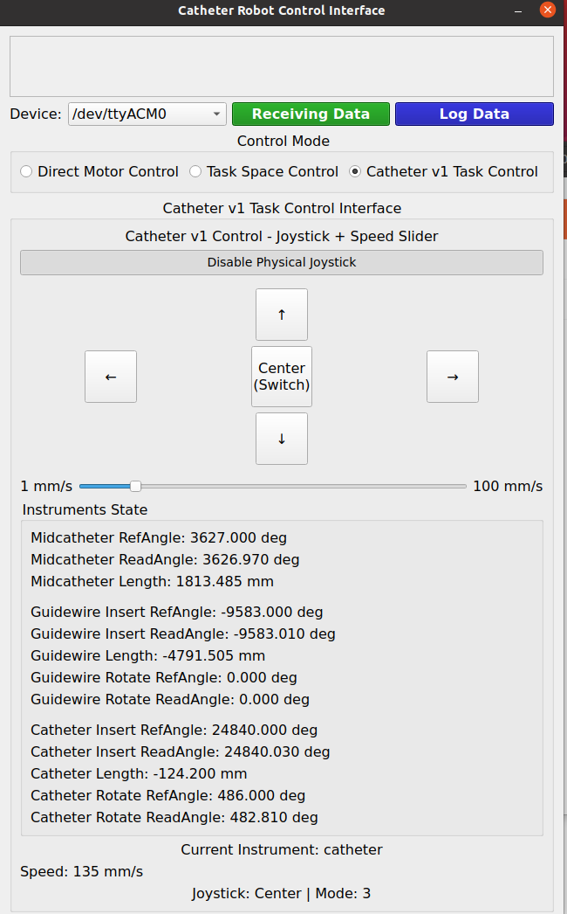

# Catheter Robot Control System

## 🔧 Software Structure

* **High-Level Control (Python GUI)**
  Refer to `2024_12_13_Catheter_Robot_GUI_V2.py` for the primary user interface and control logic.
  This script manages device connection, joystick input, and speed commands to the robot.

* **Low-Level Control (Teensy Firmware)**
  The microcontroller runs the code in `2025_01_10_Teensy_Catheter_GUI.ino`.
  It receives commands from the PC and controls the motors accordingly.

## 📝 Instructions

1. Launch the Python GUI script:
   `2024_12_13_Catheter_Robot_GUI_V2.py`

2. In the GUI:

   * Click **“Connect”** to open the device selection dialog.
   * Choose the appropriate serial device.
   * Check **“Enable Physical Joystick”**.
   * Use the **slider** to select speed.
   * You can now operate the robot using the joystick.

## 🛠 Modifying Behavior

To customize the control logic or robot behavior, modify the code in `2024_12_13_Catheter_Robot_GUI_V2.py`.

The Teensy firmware generally does **not** require changes unless you're altering the motor control protocol.

